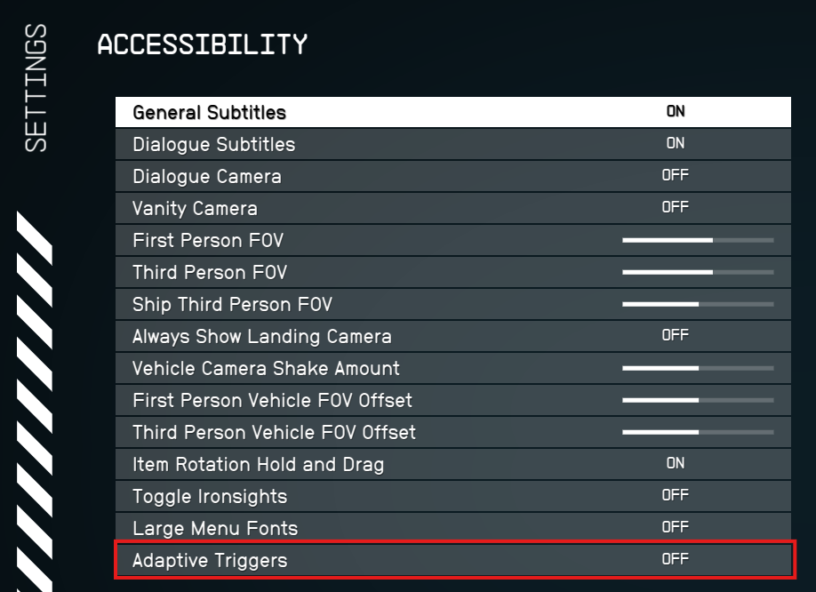

# Starfield Advanced DualSense (SAD)

[](CHANGELOG.md)
[](#requirements)
[](#requirements)
[](xmake.lua)
[](LICENSE)

**Starfield Advanced DualSense (SAD)** adds deep PlayStation DualSense support to **Starfield on PC** with one goal: **make the controller feel like Starfield shipped with native DualSense support.**

SAD is not a generic rumble wrapper or an Xbox-controller emulation layer. It uses Starfield's own gameplay state, input, audio, and Wwise events to drive adaptive triggers, haptics, controller-speaker audio, touchpad/lightbar behavior, and reconnect handling in ways that are tied to what is actually happening in the game.

> **Native-first design:** plug a DualSense into the PC with a USB cable and use it the same way you would with a PC game that has built-in DualSense features. SAD does **not** require DSX, DualSenseX, reWASD, or similar controller-emulation software.

---

## Features

| Feature | What SAD adds |
| --- | --- |
| **Adaptive Triggers** | Gameplay-aware trigger resistance and weapon-specific effects, including on-foot and ship combat behavior. |
| **Advanced Haptics** | Tactile feedback for weapons, damage, movement/gameplay events, ships, the REV-8, Digipicks, boostpack use, and more. |
| **Music Haptics** | Optional score-driven tactile feedback mixed underneath gameplay haptics so combat and other gameplay effects keep priority. |
| **Controller Speaker** | Selected real in-game audio routed to the DualSense speaker, including supported communications, UI/scanner sounds, weapons, Digipicks, crafting/research, and boostpack audio. |
| **Digipick Feedback** | Real Digipick sounds through the controller speaker plus tactile feedback for rotation, shape selection, successful insertion, and puzzle completion. |
| **Crafting / Research Audio** | Supported crafting, cooking, medical, industrial, weapon/armor, and research station sounds through the controller speaker. |
| **Boostpack Feedback** | Dedicated boostpack haptics and real boostpack audio through the controller speaker. |
| **Touchpad & Lightbar** | DualSense-specific controller features integrated into the runtime. |
| **Reconnect Repair** | Repairs the Starfield timing problem that can cause a reconnected DualSense to fall back to a generic/Xbox-style controller path. |
| **ReconnectFixOnly Mode** | Runs only the passive reconnect repair if you want Starfield's native DualSense handling without the rest of SAD's feedback stack. |

Where controller-speaker audio is supported, SAD prefers **real Starfield audio** rather than invented replacement beeps. The same evidence-first approach is used throughout the project: feedback is tied to proven game state or native events instead of guessed timers whenever possible.

---

## Touchpad Controls

When `Touchpad = true`, SAD adds native DualSense touchpad shortcuts:

| Gesture | Action |
| --- | --- |
| **Swipe Up** | Open Inventory |
| **Swipe Down** | Open Missions |
| **Swipe Left** | Open Powers |
| **Swipe Right** | Open Skills |
| **Press the right side of the touchpad** | Open Map |
| **Press Create** | Open Photo Mode |

The **left side of the touchpad click remains native to Starfield** and keeps its normal POV behavior.

If **Powers have not been unlocked yet**, swiping left uses Starfield's native `QuickPowers` action and falls back to the **Data Menu** — the main character menu — instead of opening the Powers screen.

These shortcuts use Starfield's native input actions rather than simulating keyboard presses.

---

## Requirements

### Required

- **Starfield for PC**
- **Windows**
- **Sony DualSense or DualSense Edge controller**  
  DualSense Edge is supported as a standard DualSense controller.  
  Edge-specific features such as rear paddles and Fn controls are not currently used by SAD.
- **USB cable / wired controller connection**
- **SFSE (Starfield Script Extender)** — required to load the SAD plugin DLL

### Optional

- **SFSE Menu Framework / compatible in-game settings menu support** — only needed if you want to change SAD settings from inside Starfield

You do **not** need the in-game menu to use SAD. If you prefer, configure the mod entirely through `StarfieldDualSense.toml`.

> **Important SFSE distinction:** SFSE itself is required because SAD is an SFSE plugin. The **menu framework is optional**. Without the menu framework, SAD still runs normally and reads its settings from the TOML file.

---

## Wired DualSense — No DSX Required

SAD is designed around a **real wired DualSense**, just like PC games that expose native DualSense features.

Use the controller over **USB** for the full feature set. The controller's advanced audio/haptic path and native PlayStation behavior should not be expected through a generic Bluetooth or controller-emulation route.

SAD does **not** require:

- DSX
- DualSenseX
- reWASD
- an Xbox-controller wrapper
- a virtual-controller layer

Software that masks, remaps, or virtualizes the DualSense can interfere with native device detection, PlayStation glyphs, adaptive triggers, haptics, controller audio, or reconnect behavior. If you are troubleshooting SAD, test first with the DualSense connected directly by USB and without a controller-emulation layer in between.

---

## Important: Disable Starfield's Accessibility Adaptive Triggers

Before using SAD's adaptive-trigger system, open Starfield's own settings and set:

**Settings → Accessibility → Adaptive Triggers → OFF**

Starfield's built-in accessibility trigger option can conflict with SAD's trigger presentation, so SAD expects that setting to be disabled.



---

## Installation

### 1. Install SFSE

Install a version of **SFSE** compatible with your installed Starfield runtime.

Located here: https://www.nexusmods.com/starfield/mods/106

SAD is an SFSE plugin and is loaded from the standard SFSE plugin directory.

### 2. Install SAD

A normal runtime installation places these files under your Starfield `Data` directory:

```text
Data\SFSE\Plugins\StarfieldDualSense.dll
Data\SFSE\Plugins\StarfieldDualSense.toml
```

You can also install SAD with a mod manager such as **Vortex** or **Mod Organizer 2 (MO2)** instead of copying the files manually.

### 3. Optional: install in-game menu support

If you want to change SAD settings from inside the game, install the compatible SFSE Menu Framework mod.

Located here: https://www.nexusmods.com/starfield/mods/18201

If you do **not** want the in-game menu, skip that part and edit:

```text
Data\SFSE\Plugins\StarfieldDualSense.toml
```

directly.

### 4. Connect the DualSense by USB

Connect the controller with a USB cable before launching the game.

### 5. Disable Starfield's own Adaptive Triggers accessibility option

Set **Settings → Accessibility → Adaptive Triggers** to **OFF** as shown above.

---

## Configuration

The default configuration lives at:

```text
config\StarfieldDualSense.toml
```

and the installed runtime configuration normally lives at:

```text
Data\SFSE\Plugins\StarfieldDualSense.toml
```

The TOML is organized by feature area and documents the accepted syntax and ranges directly in the file.

### Main settings

| Area | Examples |
| --- | --- |
| Runtime | `OperatingMode`, `DualSenseReconnectFix` |
| Adaptive Triggers | `AdaptiveTriggers`, `TriggerStrength` |
| Haptics | `AdvancedHaptics`, `HapticStrength`, `BoostpackHaptics`, `BoostpackHapticsStrength`, `MusicHapticsEnabled`, `MusicHapticsStrength` |
| Controller Speaker | `ControllerSpeaker`, `SpeakerVolume`, `SpeakerOutputMode`, `SpeakerComms`, `SpeakerScannerUI`, `SpeakerWeapons`, `SpeakerWeaponsVolume`, `SpeakerDigipick`, `SpeakerCrafting`, `SpeakerBoostpack`, `SpeakerBoostpackVolume` |
| Controller Features | `Lightbar`, `Touchpad` |
| Diagnostics | `DebugLogging` |

### Operating modes

`OperatingMode` accepts two modes:

```toml
OperatingMode = "Full"
```

Runs the full SAD feature set.

```toml
OperatingMode = "ReconnectFixOnly"
```

Runs only the passive DualSense reconnect-repair path. In this mode, the reconnect fix is forced on and SAD does not run the normal haptics, adaptive triggers, speaker, lightbar, touchpad, or other full-mode feedback systems.

See [`config/StarfieldDualSense.toml`](config/StarfieldDualSense.toml) for the current settings, comments, valid values, and ranges.

---

## Controller Speaker Output Modes

SAD supports a master controller-speaker path plus feature-specific routing.

For supported remote/radio communication audio:

```toml
SpeakerOutputMode = "Both"
```

plays qualifying audio through Starfield's normal output and the controller speaker.

```toml
SpeakerOutputMode = "ControllerOnly"
```

allows qualifying remote/radio audio to move to the controller speaker after controller playback has been accepted.

Weapon, Digipick, crafting, boostpack, and other supported speaker categories have their own settings and remain tied to their intended game behavior.

---

## Building From Source

### Prerequisites

- Windows
- Git
- Visual Studio / MSVC C++ build tools
- **XMake 3.0.0+**
- C++23-capable toolchain

### Bootstrap CommonLibSF

From the repository root:

```powershell
.\scripts\bootstrap.ps1
```

If XMake is not installed and `winget` is available:

```powershell
.\scripts\bootstrap.ps1 -InstallXMake
```

### Bootstrap pinned Vorbis decoder inputs

```powershell
.\scripts\bootstrap-vorbis-deps.ps1
```

The decoder bootstrap script downloads pinned `stb_vorbis` and `ww2ogg` inputs and verifies their Git blob hashes before use.

### Build

```powershell
.\scripts\build.ps1
```

### Build and install

```powershell
.\scripts\build.ps1 -Install
```

The project currently targets **x64**, **C++23**, and **XMake 3.0.0+**.

---

## Project Layout

```text
config/      Default runtime configuration
docs/        Design notes, implementation plans, and hardware/testing records
include/     Public/internal project headers
scripts/     Bootstrap and build helpers
src/         Plugin, runtime, platform, and tooling source
tests/       Focused C++ and Python regression tests
xmake.lua    Build configuration
```

The repository intentionally keeps extensive engineering and test history. If you are interested in how a specific feature was discovered or validated, browse [`docs/testing`](docs/testing), [`docs/superpowers/specs`](docs/superpowers/specs), and [`docs/superpowers/plans`](docs/superpowers/plans).

For version history, see [`CHANGELOG.md`](CHANGELOG.md).

---

## Design Philosophy

SAD is deliberately built to avoid feeling like a layer pasted on top of Starfield.

The project favors:

- native Starfield state and event authority
- real physical DualSense input
- actual game audio for controller-speaker features
- feature-specific haptics instead of one-size-fits-all vibration
- finite, contextual adaptive-trigger effects
- hard menu/loading/lifecycle boundaries so stale feedback does not leak between game states
- direct USB DualSense behavior instead of virtual Xbox-controller emulation

The result is intended to feel **integrated with Starfield**, not merely connected to it.

---

## Troubleshooting Basics

If SAD is not behaving as expected, start with these checks:

1. Connect the DualSense directly by **USB**.
2. Confirm **SFSE** is installed and compatible with your Starfield runtime.
3. Confirm `StarfieldDualSense.dll` and `StarfieldDualSense.toml` are under `Data\SFSE\Plugins`.
4. Set Starfield's **Accessibility → Adaptive Triggers** option to **OFF**.
5. Temporarily disable DSX, DualSenseX, reWASD, or other controller virtualization/remapping software.
6. Check your TOML settings and enable `DebugLogging` only when diagnostic logs are actually needed.

---

## License

Starfield Advanced DualSense is licensed under the **GNU General Public License v3.0**.

See [`LICENSE`](LICENSE) for the full license text.

---

## Disclaimer

Starfield and related names are trademarks of Bethesda Softworks / ZeniMax Media. DualSense and PlayStation are trademarks of Sony Interactive Entertainment.

This is a fan-made project and is not affiliated with or endorsed by Bethesda, ZeniMax, Sony, or PlayStation.
