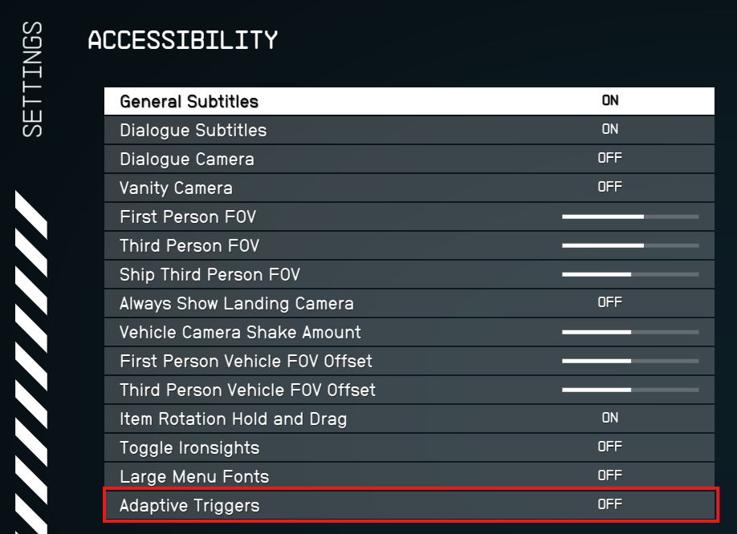

# Starfield Advanced DualSense (SAD)

[](CHANGELOG.md)
[](#requirements)
[](#requirements)
[](xmake.lua)
[](LICENSE)

**Starfield Advanced DualSense (SAD)** adds deep PlayStation DualSense support to **Starfield on PC** with one goal: **make the controller feel like Starfield shipped with native DualSense support.**

SAD is not a generic rumble wrapper or an Xbox-controller emulation layer. It uses Starfield's own gameplay state, input, audio, and Wwise events to drive adaptive triggers, haptics, controller-speaker audio, touchpad/lightbar behavior, and reconnect handling in ways that are tied to what is actually happening in the game.

> **Native-first design:** connect a DualSense over USB or Bluetooth and use it directly. SAD does **not** require DSX, DualSenseX, reWASD, an Xbox-controller wrapper, or another virtual-controller layer.

---

## Features

| Feature | What SAD adds |
| --- | --- |
| **Native USB + Bluetooth** | Direct DualSense and DualSense Edge support over USB and Bluetooth without requiring DSX, DualSenseX, reWASD, an Xbox wrapper, or another virtual controller. |
| **Adaptive Triggers** | Gameplay-aware trigger resistance and weapon-specific effects, including on-foot weapons, ships, and the REV-8. |
| **Advanced Haptics** | Tactile feedback for weapons, damage, movement/gameplay events, ships, the REV-8, Digipicks, boostpack use, launch/landing events, and more. USB uses the DualSense audio-haptics path; Bluetooth uses SAD's native Bluetooth vibration path for supported feedback. |
| **Weapon Haptics Controls** | A master weapon-vibration switch plus per-family enable and `0.0-3.0` strength controls for 13 on-foot weapon groups, applied live to USB and Bluetooth haptics. |
| **DualSense Edge** | Standard SAD DualSense features are supported on Edge hardware, including USB output-report sizing for the Edge's larger HID report. Rear paddles and Fn controls are not separately mapped. |
| **Music Haptics** | Optional score-driven tactile feedback mixed underneath gameplay haptics so combat and other gameplay effects keep priority. |
| **Controller Speaker** | Real Starfield audio through the DualSense speaker over USB or Bluetooth, including supported communications, UI/scanner sounds, weapons, Digipicks, crafting/research, and boostpack audio. |
| **Dataslate / Comms Voice** | Supported spoken dataslates and communications can use `Both` or `ControllerOnly` output while preserving Starfield's native STOP/PLAY and continuation behavior. |
| **Digipick Feedback** | Real Digipick sounds through the controller speaker plus tactile feedback for rotation, shape selection, successful insertion, and puzzle completion. |
| **Crafting / Research Audio** | Supported crafting, cooking, medical, industrial, weapon/armor, and research-station sounds through the controller speaker. |
| **Boostpack Feedback** | Dedicated boostpack haptics and real boostpack audio through the controller speaker. |
| **Touchpad** | Native DualSense touchpad shortcuts using Starfield's own input actions. |
| **Dynamic Lightbar** | Player-health colors, a Main Menu white-to-blue breathing effect, and ship takeoff/landing/touchdown lighting. |
| **Battery Indicator** | The five DualSense player-indicator LEDs act as a battery gauge on both USB and Bluetooth. |
| **Reconnect Repair** | Repairs Starfield's reconnect timing and preserves DualSense identity/input across USB <-> Bluetooth handoffs, including the late USB HID ownership refresh needed for stable SAD lightbar/player-LED control. |
| **ReconnectFixOnly Mode** | Runs only the passive reconnect repair if you want Starfield's native DualSense handling without the rest of SAD's feedback stack. |

Where controller-speaker audio is supported, SAD prefers **real Starfield audio** rather than invented replacement beeps. The same evidence-first approach is used throughout the project: feedback is tied to proven game state or native events instead of guessed timers whenever possible.

## Weapon Haptics Controls

SAD lets weapon vibration be tuned separately from the rest of the gameplay-haptic system.

The master setting:

```text
WeaponHaptics = true
```

controls **on-foot weapon vibration only**. Turning it off does not disable adaptive triggers, controller-speaker weapon audio, damage feedback, boostpack feedback, ship/vehicle feedback, or Digipick haptics.

Each weapon family has its own enable switch and `0.0-3.0` strength multiplier. For example:

```text
WeaponHapticsBallisticHandguns = true
WeaponHapticsBallisticHandgunsStrength = 1.0

WeaponHapticsSustainedEnergy = true
WeaponHapticsSustainedEnergyStrength = 1.0
```

`1.0` preserves SAD's authored tuning, values below `1.0` reduce that family, and values above `1.0` strengthen it. The family multiplier applies to both USB and Bluetooth weapon haptics and is combined with the normal global haptic settings.

The available groups are **Ballistic Handguns, Rapid Ballistics, Ballistic Rifles, Precision Ballistics, Shotguns, Heavy Ballistics, Launchers, Magnetic, Laser, Particle, Sustained Energy, EM, and Melee**. The **Cutter** and **Arc Welder** are in **Sustained Energy**.

## Touchpad Controls

When `Touchpad = true`, SAD adds native DualSense touchpad shortcuts:

| Gesture | Action |
| --- | --- |
| **Swipe Up** | Open Inventory |
| **Swipe Down** | Open Missions |
| **Swipe Left** | Open Powers |
| **Swipe Right** | Open Skills |
| **Press the right side of the touchpad** | Open Map |
| **Press Create** | Open Photo Mode |

The **left side of the touchpad click remains native to Starfield** and keeps its normal POV behavior.

If **Powers have not been unlocked yet**, swiping left uses Starfield's native `QuickPowers` action and falls back to the **Data Menu** — the main character menu — instead of opening the Powers screen.

These shortcuts use Starfield's native input actions rather than simulating keyboard presses.

---

## Lightbar and Battery Indicators

### Colored Lightbar

When `Lightbar = true`, SAD uses the DualSense lightbar for contextual visual feedback.

#### Player Health

| Player Health | Lightbar |
| --- | --- |
| **Above 50%** | Blue |
| **25%-50%** | Orange |
| **Below 25%** | Red |

#### Main Menu

While the Main Menu is open, the lightbar smoothly breathes:

    White -> Blue -> White

The full breathing cycle is approximately four seconds.

#### Ship Takeoff and Landing

SAD also uses the lightbar during supported ship launch and landing sequences:

| Ship Event | Lightbar |
| --- | --- |
| **Takeoff** | Blue / cyan |
| **Landing** | Amber |
| **Touchdown** | White flash |

Setting:

    Lightbar = false

disables **all colored SAD lightbar effects**, including player health, Main Menu, REV-8 health feedback, takeoff, landing, and touchdown lighting.

### Battery Player LEDs

The five small white **player-indicator LEDs below the touchpad** are used as a battery gauge on both USB and Bluetooth.

These LEDs are separate from the colored lightbar.

| Battery Level | Player LEDs |
| --- | ---: |
| **81%-100%** | 5 |
| **61%-80%** | 4 |
| **41%-60%** | 3 |
| **21%-40%** | 2 |
| **0%-20%** | 1 |

The LED patterns remain symmetrical as battery charge decreases:

- **1 LED:** center
- **2 LEDs:** inner pair
- **3 LEDs:** outer pair + center
- **4 LEDs:** outer pair + inner pair
- **5 LEDs:** all five

Because these are the DualSense player-indicator LEDs rather than the colored lightbar, the battery gauge is independent of `Lightbar = false`.

## Requirements

### Required

- **Starfield for PC**
- **Windows**
- **Sony DualSense or DualSense Edge controller**  
  DualSense Edge is supported for SAD's standard DualSense feature set. On USB, SAD follows the HID-reported output size, including the Edge's larger 64-byte output report.
  Edge-specific features such as rear paddles and Fn controls are not currently used by SAD.

  **DualSense Edge fix credit:** Special thanks to Nexus user [CUZZINCHIZZY](https://next.nexusmods.com/profile/CUZZINCHIZZY), who identified the USB output-size fix by testing and confirming that padding SAD's normal 48-byte USB report to the Edge's HID-reported 64-byte output size restored functionality.
- **USB or Bluetooth controller connection**
- **SFSE (Starfield Script Extender)** - required to load the SAD plugin DLL
- **Address Library for SFSE Plugins** - required by SAD/CommonLibSF for runtime address relocation

### Optional

- **SFSE Menu Framework / compatible in-game settings menu support** - only needed if you want to change SAD settings from inside Starfield

You do **not** need the in-game menu to use SAD. If you prefer, configure the mod entirely through `StarfieldDualSense.toml`.

> **Important dependency distinction:** **SFSE and Address Library for SFSE Plugins are required.** The **menu framework is optional**. Without the menu framework, SAD still runs normally and reads its settings from the TOML file.

## Native USB and Bluetooth - No DSX Required

SAD communicates directly with a real DualSense over **USB or Bluetooth**. A controller wrapper is not required.

SAD does **not** require:

- DSX
- DualSenseX
- reWASD
- an Xbox-controller wrapper
- a virtual-controller layer

Software that masks, remaps, or virtualizes the DualSense should normally be **disabled while using SAD**, because it can interfere with physical-controller detection, PlayStation identity, input, adaptive triggers, lightbar output, controller audio, or reconnect handling.

### USB vs Bluetooth

| Capability | USB | Bluetooth |
| --- | --- | --- |
| **Physical DualSense input** | Native | Native SAD HID bridge |
| **Adaptive triggers** | Supported | Supported |
| **Touchpad shortcuts** | Supported | Supported |
| **Colored lightbar** | Supported | Supported |
| **Battery player LEDs** | Supported | Supported |
| **Gameplay haptic feedback** | DualSense 4-channel audio-haptics path | Native Bluetooth vibration feedback for supported effects |
| **Controller speaker** | USB WASAPI / internal speaker | Real-time Opus audio over DualSense HID |
| **Speaker transport selection** | Automatic | Automatic |

SAD automatically chooses the correct controller-speaker transport:

    USB       -> WASAPI
    Bluetooth -> Opus / HID

Bluetooth also has its own haptic-strength setting:

    BluetoothHapticStrength = 1.0

This allows Bluetooth vibration strength to be tuned independently without changing the established USB haptic level.

USB remains the reference path for the DualSense's native 4-channel audio-haptics capability, while Bluetooth uses SAD's native wireless feedback implementation.

## Important: Disable Starfield's Accessibility Adaptive Triggers

Before using SAD's adaptive-trigger system, open Starfield's own settings and set:

**Settings → Accessibility → Adaptive Triggers → OFF**

Starfield's built-in accessibility trigger option can conflict with SAD's trigger presentation, so SAD expects that setting to be disabled.



---

## Installation

### 1. Install SFSE

Install a version of **SFSE** compatible with your installed Starfield runtime.

Located here: https://www.nexusmods.com/starfield/mods/106

SAD is an SFSE plugin and is loaded from the standard SFSE plugin directory.

### 2. Install Address Library for SFSE Plugins

Install **Address Library for SFSE Plugins**.

Located here: https://www.nexusmods.com/starfield/mods/3256

SAD uses CommonLibSF relocation support and requires Address Library at runtime.

### 3. Install SAD

A normal runtime installation places these files under your Starfield `Data` directory:

```text
Data\SFSE\Plugins\StarfieldDualSense.dll
Data\SFSE\Plugins\StarfieldDualSense.toml
```

You can also install SAD with a mod manager such as **Vortex** or **Mod Organizer 2 (MO2)** instead of copying the files manually.

### 4. Optional: install in-game menu support

If you want to change SAD settings from inside the game, install the compatible SFSE Menu Framework mod.

Located here: https://www.nexusmods.com/starfield/mods/18201

If you do **not** want the in-game menu, skip that part and edit:

```text
Data\SFSE\Plugins\StarfieldDualSense.toml
```

directly.

### 5. Connect the DualSense

Connect the controller before launching Starfield.

You can use either:

- **USB**
- **Bluetooth**

For Bluetooth, pair the DualSense normally through Windows. No DSX, DualSenseX, reWASD, or virtual Xbox controller is required.
### 6. Disable Starfield's own Adaptive Triggers accessibility option

Set **Settings → Accessibility → Adaptive Triggers** to **OFF** as shown above.

---

## Configuration

The default configuration lives at:

```text
config\StarfieldDualSense.toml
```

and the installed runtime configuration normally lives at:

```text
Data\SFSE\Plugins\StarfieldDualSense.toml
```

The TOML is organized by feature area and documents the accepted syntax and ranges directly in the file.

### Main settings

| Area | Examples |
| --- | --- |
| Runtime | `OperatingMode`, `DualSenseReconnectFix` |
| Adaptive Triggers | `AdaptiveTriggers`, `TriggerStrength` |
| Haptics | `AdvancedHaptics`, `HapticStrength`, `BluetoothHapticStrength`, `BoostpackHaptics`, `BoostpackHapticsStrength`, `MusicHapticsEnabled`, `MusicHapticsStrength` |
| Weapon Haptics | `WeaponHaptics` plus per-family enable and `0.0-3.0` strength controls for ballistic handguns, rapid ballistics, ballistic rifles, precision ballistics, shotguns, heavy ballistics, launchers, magnetic, laser, particle, sustained-energy, EM, and melee weapons |
| Controller Speaker | `ControllerSpeaker`, `SpeakerVolume`, `SpeakerOutputMode`, `SpeakerComms`, `SpeakerVoiceLanguage`, `SpeakerScannerUI`, `SpeakerWeapons`, `SpeakerWeaponsVolume`, `SpeakerDigipick`, `SpeakerCrafting`, `SpeakerBoostpack`, `SpeakerBoostpackVolume` |
| Controller Features | `Lightbar`, `Touchpad`, `BluetoothPowerOffOnExit`, `BluetoothIdleTimeoutEnabled`, `BluetoothIdleTimeoutMinutes` |
| Diagnostics | `DebugLogging` |

### Haptic Strength

`HapticStrength` supports a range of `0.0` to `3.0`.

- `1.0` preserves SAD's normal haptic tuning exactly.
- Values below `1.0` reduce haptic strength as before.
- `1.0` through `2.0` uses the first overdrive curve.
- `2.0` remains at the previously tested `2.5x` effective pre-limit gain.
- Values above `2.0` enter the extreme overdrive range.
- `3.0` reaches `5.0x` effective pre-limit gain before final actuator-output clamping.

Bluetooth still applies the separate `BluetoothHapticStrength` multiplier to SAD's Bluetooth-compatible feedback.

### Operating modes

`OperatingMode` accepts two modes:

```toml
OperatingMode = "Full"
```

Runs the full SAD feature set.

```toml
OperatingMode = "ReconnectFixOnly"
```

Runs only the passive DualSense reconnect-repair path. In this mode, the reconnect fix is forced on and SAD does not run the normal haptics, adaptive triggers, speaker, lightbar, touchpad, or other full-mode feedback systems.

See [`config/StarfieldDualSense.toml`](config/StarfieldDualSense.toml) for the current settings, comments, valid values, and ranges.

---

## Controller Speaker Output Modes

SAD supports the DualSense controller speaker over both USB and Bluetooth.

The transport is selected automatically:

    USB       -> WASAPI
    Bluetooth -> Opus / HID

The normal controller-speaker categories and volume settings apply regardless of the active transport.

For supported remote/radio communication and dataslate voice:

    SpeakerOutputMode = "Both"

plays qualifying audio through Starfield's normal output and the controller speaker.

    SpeakerOutputMode = "ControllerOnly"

routes qualifying controller voice to the DualSense while preventing duplicate normal-output playback after controller playback has been accepted.

For spoken dataslates, SAD preserves Starfield's native audio-event lifecycle rather than simply stopping the original event. This keeps native **STOP**, **PLAY**, and post-menu-exit continuation behavior working while `ControllerOnly` is active.

Weapon, Digipick, crafting, boostpack, and other supported speaker categories have their own settings and remain tied to their intended game behavior.

### Live Controller-Speaker Settings

The following settings apply live without requiring a game restart:

- `ControllerSpeaker`
- `SpeakerVolume`
- `SpeakerOutputMode`
- `SpeakerComms`
- `SpeakerVoiceLanguage`
- supported speaker-category toggles

Changing the output mode, communications setting, or voice language clears stale controller voice before the new policy takes effect.

### Radio / Comms Language

SAD can use Starfield's localized voice archives for supported radio and remote communications routed through the DualSense speaker.

The default is:

    SpeakerVoiceLanguage = "Auto"

`Auto` follows Starfield's supported voice-language settings. If localized voices are disabled, the language cannot be resolved, or Starfield reports an unsupported voice language, SAD falls back to English.

Supported values are:

    Auto
    English
    French
    German
    Spanish
    Japanese

Choosing a language explicitly overrides `Auto`. The corresponding Starfield localized voice archives must be installed for that language; SAD does not silently substitute English dialogue when an explicitly selected localized archive is unavailable.

Ship radio/intercom static and other non-voice communication effects are language-independent and use Starfield's normal sound-effect archives, so they work with every supported voice language.

`SpeakerComms = false` disables supported radio/comms voice and ship radio/intercom static from the controller speaker.

## Building From Source

### Prerequisites

- Windows
- Git
- Visual Studio / MSVC C++ build tools
- **XMake 3.0.0+**
- C++23-capable toolchain

### Bootstrap CommonLibSF

From the repository root:

```powershell
.\scripts\bootstrap.ps1
```

If XMake is not installed and `winget` is available:

```powershell
.\scripts\bootstrap.ps1 -InstallXMake
```

### Bootstrap pinned Vorbis decoder inputs

```powershell
.\scripts\bootstrap-vorbis-deps.ps1
```

The decoder bootstrap script downloads pinned `stb_vorbis` and `ww2ogg` inputs and verifies their Git blob hashes before use.

### Build

```powershell
.\scripts\build.ps1
```

### Build and install

```powershell
.\scripts\build.ps1 -Install
```

The project currently targets **x64**, **C++23**, and **XMake 3.0.0+**.

---

## Project Layout

```text
config/      Default runtime configuration
docs/        Design notes, implementation plans, and hardware/testing records
include/     Public/internal project headers
scripts/     Bootstrap and build helpers
src/         Plugin, runtime, platform, and tooling source
tests/       Focused C++ and Python regression tests
xmake.lua    Build configuration
```

The repository intentionally keeps extensive engineering and test history. If you are interested in how a specific feature was discovered or validated, browse [`docs/testing`](docs/testing), [`docs/superpowers/specs`](docs/superpowers/specs), and [`docs/superpowers/plans`](docs/superpowers/plans).

For version history, see [`CHANGELOG.md`](CHANGELOG.md).

---

## Design Philosophy

SAD is deliberately built to avoid feeling like a layer pasted on top of Starfield.

The project favors:

- native Starfield state and event authority
- real physical DualSense input
- actual game audio for controller-speaker features
- feature-specific haptics instead of one-size-fits-all vibration
- finite, contextual adaptive-trigger effects
- hard menu/loading/lifecycle boundaries so stale feedback does not leak between game states
- direct physical DualSense behavior over USB and Bluetooth instead of virtual Xbox-controller emulation

The result is intended to feel **integrated with Starfield**, not merely connected to it.

---

## Troubleshooting Basics

If SAD is not behaving as expected, start with these checks:

1. Confirm the DualSense is connected directly by **USB or Bluetooth**.
2. Confirm **SFSE** is installed and compatible with your Starfield runtime.
3. Confirm **Address Library for SFSE Plugins** is installed and compatible with your Starfield runtime.
4. Confirm `StarfieldDualSense.dll` and `StarfieldDualSense.toml` are under `Data\SFSE\Plugins`.
5. Set Starfield's **Accessibility -> Adaptive Triggers** option to **OFF**.
6. Disable DSX, DualSenseX, reWASD, virtual Xbox controllers, and other controller-remapping/wrapper software while testing SAD.
7. Check your TOML settings and enable `DebugLogging` only when diagnostic logs are actually needed.
8. If a problem appears only on Bluetooth, compare the same action once over USB to determine whether the issue is transport-specific.

### Bluetooth-Specific Checks

If Bluetooth input works but a specific feedback feature does not:

- confirm Windows still reports the physical DualSense as connected
- make sure another controller utility has not taken ownership of the device
- check `BluetoothHapticStrength` if Bluetooth vibration is too weak or too strong
- remember that USB uses the DualSense 4-channel audio-haptics path while Bluetooth uses SAD's native wireless vibration implementation

Controller-speaker audio automatically switches between USB WASAPI and Bluetooth Opus/HID when the active transport changes.

## License

Starfield Advanced DualSense is licensed under the **GNU General Public License v3.0**.

See [`LICENSE`](LICENSE) for the full license text.

---

## Disclaimer

Starfield and related names are trademarks of Bethesda Softworks / ZeniMax Media. DualSense and PlayStation are trademarks of Sony Interactive Entertainment.

This is a fan-made project and is not affiliated with or endorsed by Bethesda, ZeniMax, Sony, or PlayStation.
